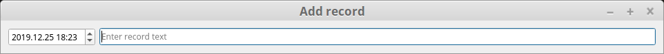
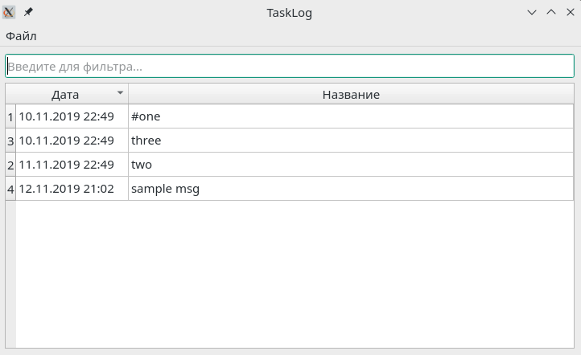

# Task log

Allows to store notes with dates in convenient textual format.

## Features

* new note dialog can be triggered with global shortcut
* saved notes can be shown, filtered and exported via built-in viewer

## Installation

Download binary for yours OS and run it
(make it executable if necessary).

## Usage

Change output file in settings if needed (`settings` entry in tray's menu).

To add entry: select `add record` entry from tray's icon context menu,
enter note's date/text and press `enter`.

Double click on tray's icon or select `show existing` entry in menu to search
stored entries from current file.

## License

This project is licensed under the MIT License - see the LICENSE.md file for details.

## Contributing

Create issue/PR on project's page on github.com.
